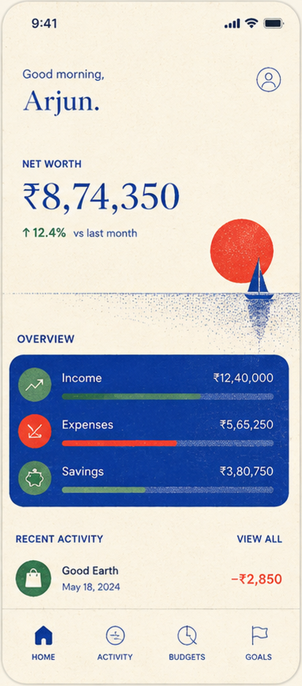

# OIKONOS

*Money, made clear.*

A personal-finance app built in the visual language of a Mediterranean
risograph print — cream paper, three inks, editorial serif, and drawings
that bleed off the page.



---

## Running it

```bash
cd app
npm install
npm run dev
```

Any screen is directly addressable, which is how the capture harness
reaches them:

```
/?screen=home
/?screen=txn&id=t001
/?screen=goal&id=g1
/?screen=goal&id=g1&sheet=contribute
```

A deep link does not get past the account guard: with no session, every
screen but `welcome`, `signup`, `signin`, `forgot` and `reset` renders
the welcome screen instead. Sign in first — the harnesses do.

## Accounts

Oikonos keeps the ledger on the device, so it keeps the account there
too. `src/data/auth.tsx` owns the whole of it:

- **Sign up** writes `{name, email, salted SHA-256 hash}` to
  localStorage and opens a session.
- **Sign in** re-hashes against the stored salt and compares.
- **The session** is a pointer to that record, so it survives a reload
  and the app opens on home rather than the welcome screen.
- **Reset** issues a six-digit code held in memory. Nothing mails it —
  the screen shows you the code and says why.
- **Sign out** lives at the bottom of Settings and clears the session
  only; the ledger stays.

The hash is the right shape but deliberately not a slow KDF: a
device-local store gains nothing from one, and a real service would
verify server-side with Argon2 or scrypt. None of it should be lifted
into a product with a back end.

The seeded ledger is Arjun's, so a seeded account comes with it —
`arjun@oikonos.app` / `aegean2024`, offered by a button on the sign-in
screen. Signing up as somebody else changes the greeting, not the
transactions.

## The design system

Everything visual resolves through four files. Nothing outside them
should introduce a colour, a type size, or a spring.

| file | holds |
| --- | --- |
| `src/styles/tokens.css` | the four inks, warm elevation, type scale, spacing, motion durations |
| `src/styles/global.css` | font faces, reset, and the three texture primitives |
| `src/lib/motion.ts` | the entire motion vocabulary — four springs and shared variants |
| `src/components/ui.tsx` | the component kit every screen is assembled from |

### The inks

| token | value | role |
| --- | --- | --- |
| `--paper` | `#faf2e1` | the sheet everything is printed on |
| `--ink` | `#0d3996` | cobalt — brand, headings, primary figures |
| `--olive` | `#2e7349` | Aegean pine — income, progress, growth |
| `--vermilion` | `#ef422d` | riso red — expenses, alarm, the one loud accent |

There is no grey in the system. Shadows are warm brown; "muted" text is
cobalt stepped toward paper. A neutral grey anywhere is a bug.

### Texture

Riso printing is paper tooth, uneven ink lay-down, and misregistration.
Three utilities reproduce it, applied by surface type:

- `.tex-paper` — fine fibre, soft-light, over cream
- `.tex-ink` — coarse speckle, overlay, over saturated fields
- `.tex-card` — canvas weave, over raised cream surfaces

The tiles in `public/tex/` are generated seamless (wrap-tiled, blurred,
re-cropped) so they never seam at any background-size.

### Motion

Four springs, no more: `snap` (press), `gentle` (element), `surface`
(sheet), `screen` (route). Springs rather than curves so an interrupted
gesture keeps its momentum instead of jumping. Every animated primitive
reads `useReducedMotion` and collapses to a static end state.

### Money

`src/lib/format.ts` owns all number rendering. Indian grouping
(`₹8,74,350`, not `₹874,350`), a true minus sign for outflows, and
tabular numerals everywhere so a counting-up figure does not shimmer.

## Verification

```bash
export PW_CHROMIUM=/opt/pw-browsers/chromium-1194/chrome-linux/chrome

npx tsc -b --noEmit        # types
node tools/shoot.mjs       # render every screen to shots/
node tools/shoot.mjs --bare home    # screen only, no device frame
node tools/flow.mjs        # drive the app and assert it actually works
```

### Blind comparison

`tools/duel.py` composites a render and the master comp onto one sheet at
identical dimensions with matched corners, labelled only A and B. The
side assignment is seeded and the answer key is written to `.duelkeys/`,
outside the directory the critic reads — so a reviewer judging the sheet
cannot know which panel is which.

```bash
python3 tools/duel.py home shots/bare/home.png reference/phone2.png
```

## Layout

```
app/
  reference/        the master comps, one per hero screen
  public/
    fonts/          self-hosted Fraunces + Inter (with the ₹ glyph)
    tex/            generated seamless riso textures
  src/
    components/     device shell, UI kit, charts, icons
    data/           types, seed, store + selectors
    illustrations/  one SVG scene per screen
    lib/            formatting, motion
    screens/        one file per route, sheets/ underneath
  tools/            shoot / duel / flow
```

`BRIEF.md` is the build contract every screen was written against.
